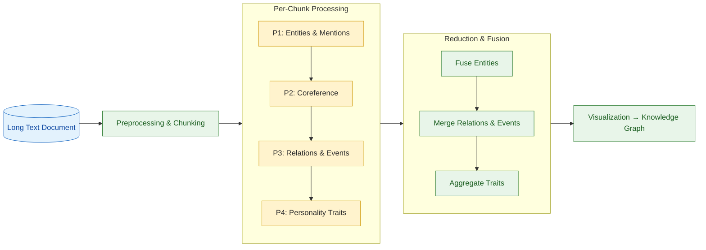
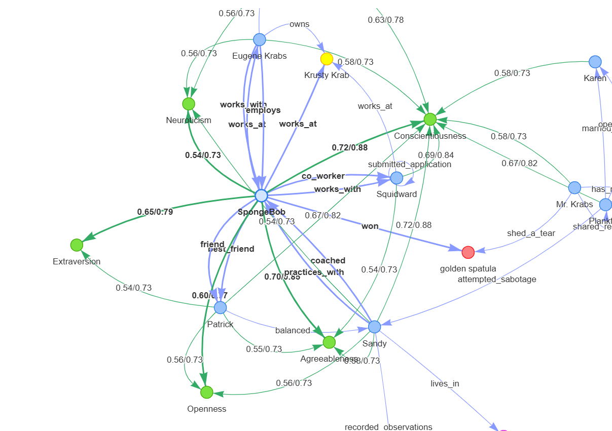

# 🧠 Intellumia_KG — Knowledge Graph Extraction from Text Documents

## 📘 Overview

**Intellumia_KG** is an end-to-end system that transforms long unstructured text documents into structured, explainable **Knowledge Graphs (KGs)**.  
It not only extracts **entities, relations, and events** from natural language, but also models **personality traits** of subjects based on contextual evidence.

The system uses **Large Language Models (LLMs)** as reasoning engines at several stages, combined with deterministic data handling and confidence calibration to ensure accuracy, interpretability, and cost efficiency.
Design walkthrough: [Watch here](https://www.loom.com/share/82e6e9eea18d45cd812de5579345ec4b?sid=a54cad1e-e02f-40dc-9702-b291ec3f742b) [https://www.loom.com/share/82e6e9eea18d45cd812de5579345ec4b?sid=a54cad1e-e02f-40dc-9702-b291ec3f742b](https://www.loom.com/share/82e6e9eea18d45cd812de5579345ec4b?sid=a54cad1e-e02f-40dc-9702-b291ec3f742b)

---

## 🎯 Key Features

- **Entity Recognition & Canonicalization:** Identifies people, organizations, artifacts, and locations; merges duplicates across documents.
- **Relation & Event Extraction:** Derives contextual relationships and events between entities using adaptive prompts.
- **Personality Trait Modeling:** Estimates human-like traits (e.g., conscientiousness, courage) from behavioral text patterns.
- **LLM Workflow Chaining:** Multi-stage reasoning pipeline instead of single prompts, ensuring controllable intermediate steps.
- **Graph Assembly & Visualization:** Builds interactive knowledge graphs (via NetworkX + PyVis) with traceable evidence.
- **Confidence Calibration & Validation:** Each edge or trait is backed by a support span and local confidence score.

---

## 🧪 Reproducibility

### 1. Clone the Repository

```bash
git clone https://github.com/Andreas-UI/intellumia_kg.git
cd intellumia_kg
```

### 2. Create a Virtual Environment

```bash
conda create -n intellumia_kg python=3.10 -y
conda activate intellumia_kg
```

Or using `venv`:

```bash
python -m venv venv
source venv/bin/activate  # (Windows: venv\Scripts\activate)
```

**Minimal requirements:**
Using python 3.10.8 (gpu)
```
langchain
pyvis
networkx
pydantic>=2.0
openai
python-dotenv
matplotlib
```

### 3. Set Up `.env` File

Create a file named **`.env`** in the project root with your OpenAI key:

```bash
OPENAI_API_KEY=sk-xxxxxxxxxxxxxxxxxxxxxxxxxxxxxxxxxxxxxxxx
MODEL=gpt-4o-mini
```

> ⚠️ **Do not hard-code your API key** in code for security reasons — always load from `.env`.

The system will automatically read these values inside `llm.py` using `dotenv`:

```python
from dotenv import load_dotenv
import os
load_dotenv()
api_key = os.getenv("OPENAI_API_KEY")
model = os.getenv("MODEL", "gpt-4o-mini")
```

---

### 5. Run the Pipeline

Run the full KG extraction:

```bash
python main.py
```

* Input: `doc.txt` (plain text file, e.g., the SpongeBob document).
* Output:

  * `kg_graph.html` — interactive visualization.
  * Intermediate JSONs (optional): `coref.json`, `rels_ev.json`, `traits.json`.

To open the graph:

```bash
start kg_graph.html    # Windows
# or
open kg_graph.html     # macOS
# or
double click the file
```


## 🧩 System Architecture

```

Input Text  →  Preprocessing  →  P1–P4 Pipelines  →  R1–R3 Reducers  →  KG Visualization

````



| Stage | Module | Purpose |
|--------|---------|----------|
| **P1** | `entities_mentions` | Extracts named entities and mentions using LLMs. |
| **P2** | `coref_canonicalize` | Merges duplicate entities and builds canonical global IDs (coreference resolution). |
| **P3** | `relations_events` | Extracts relations and events between canonical entities. Uses adaptive snake_case labels (fallback: `involved_in`). |
| **P4** | `trait_window` | Infers personality traits per individual using sentence windows around mentions. |
| **R1–R3** | Reducers | Fuse and aggregate relations, events, and trait evidence across chunks. |
| **V** | Validation | Checks consistency, missing spans, duplicate IDs, and edge support. |
| **G** | Graph Assembly | Writes final versioned KG to file or Neo4j; supports visualization via PyVis or export to GEXF. |

---

## ⚙️ End-to-End Pipeline (Main Function)

```python
def main(file_path):
    chunks = doc_chunk(file_path)
    ents_results = [p1_entities_mentions(client, c["chunk_id"], c["text"]) for c in chunks]
    coref = p2_coref_canonicalize(client, p1_chunks=ents_results, chunk_texts={c["chunk_id"]: c["text"] for c in chunks})
    rels_ev_all, trait_evs = [], []

    for ch, ents in zip(chunks, ents_results):
        rels_ev_all.append(p3_relations_events(client, "D1", ch["chunk_id"], ch["text"], ents["entities"], coref["coref_map"]))
        for person in persons_in_chunk(ents["entities"], coref["coref_map"], ch["chunk_id"]):
            for win in windows_for_person(ch["text"], ch["sent_index"], person["mentions"], window_size=1):
                tr = p4_trait_window(client, person["display_name"], win["text"], require_spans=True)
                cal = calibrate_trait_probs(tr["trait_probs"])
                trait_evs += convert_trait_json_to_evidence(person["canonical_id"], win, cal, tr["evidence"])

    rels_ev_fused = r2_fuse_relations_events(rels_ev_all)
    trait_edges = r3_aggregate_traits_beta(trait_evs)
    return coref, rels_ev_fused, trait_edges
````

Then visualize:

```python
coref, rels_ev_fused, trait_edges = main("doc.txt")
G = build_nx_graph(coref["entities_canonical"], rels_ev_fused, trait_edges)
draw_pyvis(G, "kg_graph.html")
```

---

## 🖼 Visualization

You can visualize the extracted KG interactively in your browser:

```python
G = build_nx_graph(coref["entities_canonical"], rels_ev_fused, trait_edges)
draw_pyvis(G, "kg_graph.html")
```

---

## 🧪 Example Output



The graph shows entities as nodes (yellow for Person, blue for Org),
relations as directed edges (labels like `works_at`, `friend_of`),
and personality traits as green leaf nodes connected by `HAS_TRAIT` edges.

---


## 🧩 Folder Structure

```
intellumia_kg/
│
├── main.py                        # Orchestrates full pipeline
├── doc_chunk.py                   # Text chunking utility
├── llm.py                         # LLM wrapper class (reusable)
├── entities_mentions.py
├── coref_canonicalize.py
├── relations_events.py
├── trait_window.py
├── r2_fuse_relations_events.py
├── r3_aggregate_traits_beta.py
|
├── prompt                          # LLM prompts
├── schemas                         # LLM output schemas
│
├── helpers_people_windows.py      # Sentence window utilities
|
├── doc.txt        # Example gold evaluation dataset
└── README.md                      # This file
```

---

## 👨‍💻 Authors

- **Andreas Susanto** — Lead Developer & Researcher
- **ChatGPT (GPT-5)** — Assistant
